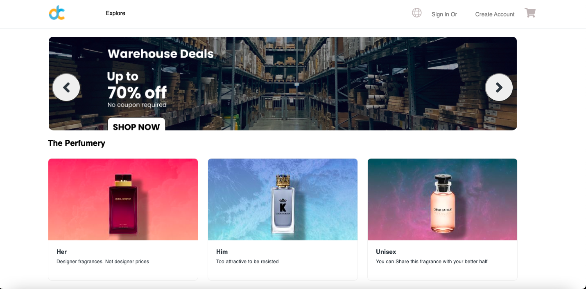
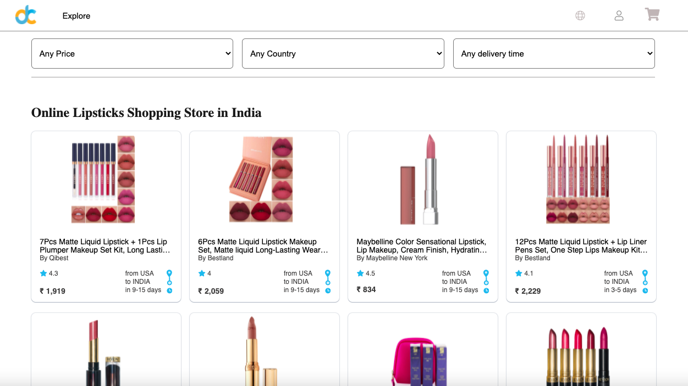
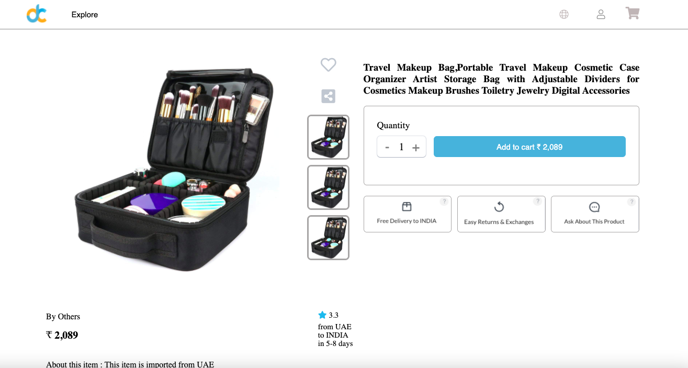
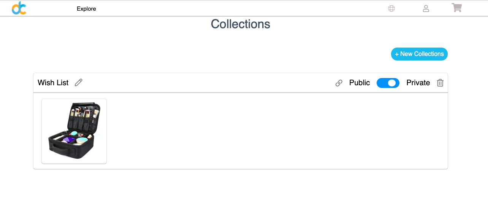

# DesertCart_Clone

  

## DesertCart-Website-Clone 
 
---
 
##### This is clone website of DesertCart.com. Desert Cart is an ecommerse website where user can buy all kinds of beauty products.
 
---
 
#### [Deployement ](https://rahulk612.github.io/desertCart/)🔗
 
---
   
## Tech Stack 🔧  
- `HTML`  
- `CSS3`  
- `Advanced JavaScript`    
---
## Features   
# - User can buy any type of products.  
# - They can use this website from 163+ countries.  
# - Users can sort & filter different kinds of products according to price, delivery time and importing country.  
# - Users can add product to wishlist.  
---    
## Page and Responsibilities    

- **Home Page**
##### here is the landing page of our website

---

- **Product Page**
##### Here user can filter/Sort the products according to choice

---

- **Product Description Page**
##### Here User can get more information about product

---
<!-- - **Cart Page**
##### From here user can add and remove products from cart

--- -->

- **Wish List Page**
##### here users can save their favorite products.

<!-- ---

- **Checkout Page**
##### Here user can add address 

---
- **Payment Page**
##### here user will have to fill their payment details then they will be notified that their order has been placed.

--- -->

### How To Use 	📌
Users can log in into the website by clicking the login button and fill in the right credentials, 
new users can register themself by clicking on the register button and fill a simple form, after successful 
login user can start shopping, they can choose the category that they like also they can sort the product 
according to their choice, after choosing a product they can add it to the cart or keep it on the wishlist.
They can place an order by simply clicking on the place order button after that they will get notified that their 
 order has been successfully placed.

## Creators  🤝🏻	

#### Rahul Konda  [GitHub](https://github.com/Rahulk612) :octocat:

#### Kavya [GitHub](https://github.com/kavya-2021) :octocat:

#### Ravindra Sham Pawar [GitHub](https://github.com/Ravindraapps) :octocat:

#### Aswini Rathod [GitHub] :octocat:

#### Abhishek [GitHub] :octocat:

 

